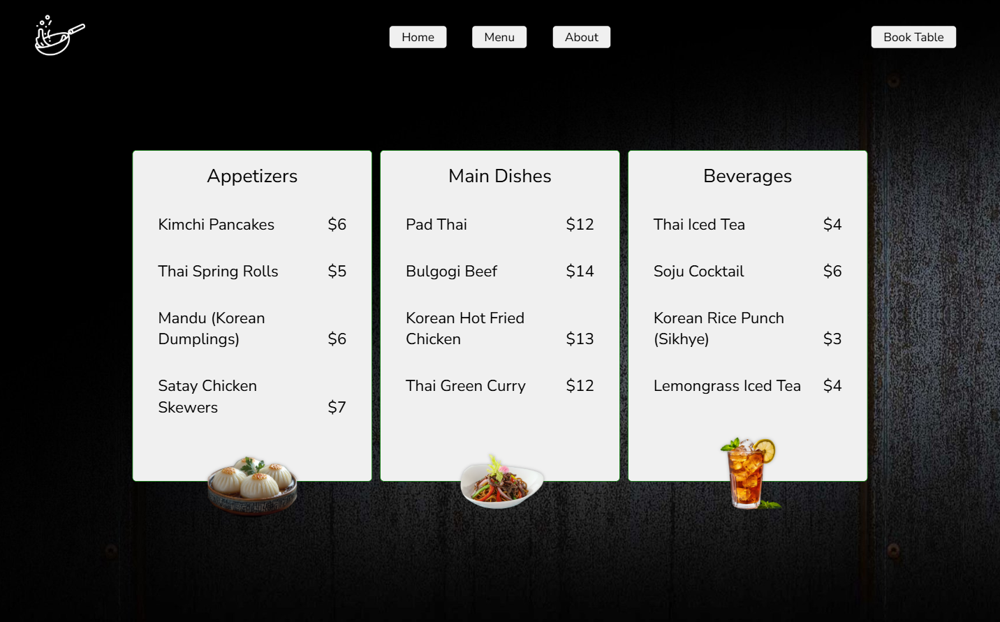
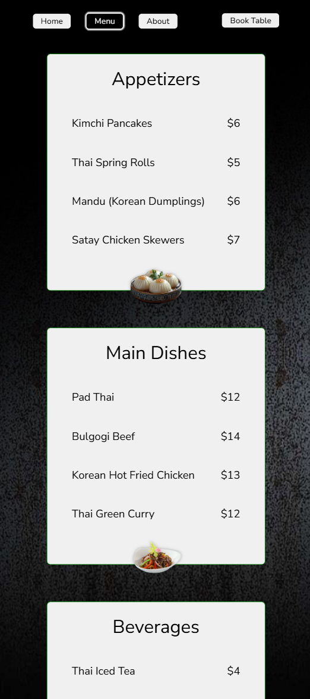

# Restaurant Page

## 🔗 [Live Demo](https://orianaland.github.io/Restaurant-Page/)

  
  

## Project Description

A dynamic restaurant website built with JavaScript as part of [The Odin Project](https://www.theodinproject.com/) curriculum. This project demonstrates modern frontend development techniques including module bundling with Webpack and dynamic DOM manipulation.

## Key Features

- **Tabbed Navigation**: Smooth transitions between Home, Menu, and Contact sections
- **Dynamic Content Rendering**: JavaScript-generated page content
- **Responsive Design**: Adapts to mobile and desktop screens
- **Modern Build Process**:
  - Webpack module bundling
  - Asset optimization
  - SCSS preprocessing
- **Visual Appeal**:
  - Appetizing food photography
  - Clean, restaurant-appropriate typography
  - Subtle animations

## Technologies Used

- **Frontend**:
  - HTML5 semantic markup
  - CSS3 with SCSS preprocessing
  - JavaScript (ES6 Modules)
- **Build Tools**:
  - Webpack 5
  - Babel
  - Loaders (CSS, SCSS, File)
- **Design**:
  - Responsive layout
  - CSS Grid and Flexbox
  - Google Fonts

## 📂 Folder Structure

Restaurant-Page/
├── dist/ # Production build
├── src/ # Source files
│ ├── assets/ # Images and fonts
│ ├── scripts/ # JavaScript modules
│ ├── styles/ # SCSS stylesheets
│ ├── index.html # Main HTML file
│ └── index.js # Entry point
├── webpack.config.js # Webpack configuration
└── package.json # Project dependencies

## Screenshots

### Desktop View

### Mobile View

## Development Notes

This project was an excellent opportunity to:

- Practice JavaScript module patterns
- Implement Webpack from scratch
- Create dynamic page content without page reloads
- Structure SCSS for maintainability
- Optimize assets for web performance

## Installation

To run this project locally:

``bash

# Clone the repository

git clone https://github.com/OrianaLand/Restaurant-Page.git

# Navigate to project directory

cd Restaurant-Page

# Install dependencies

npm install

# Start development server

npm run start

# Build for production

npm run build
